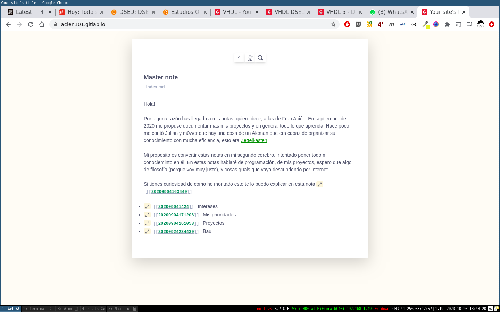
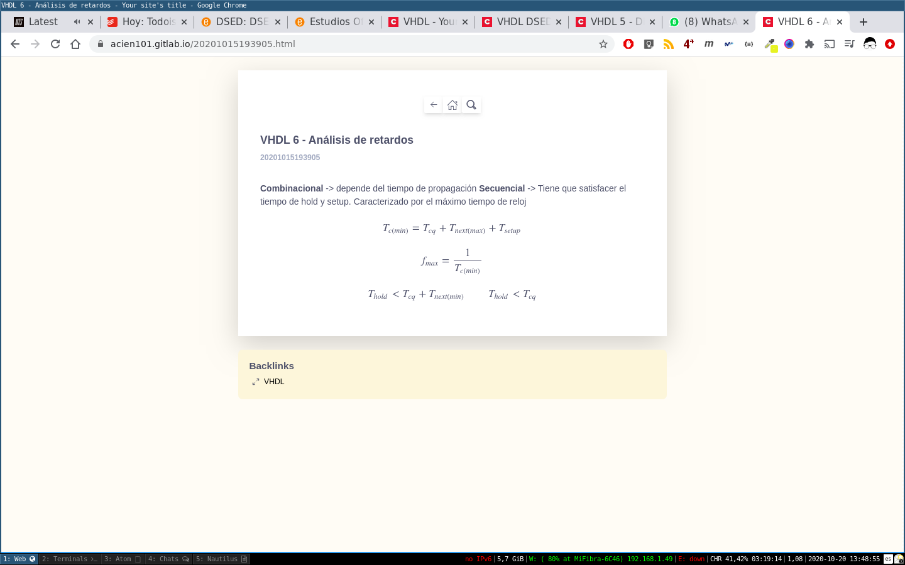
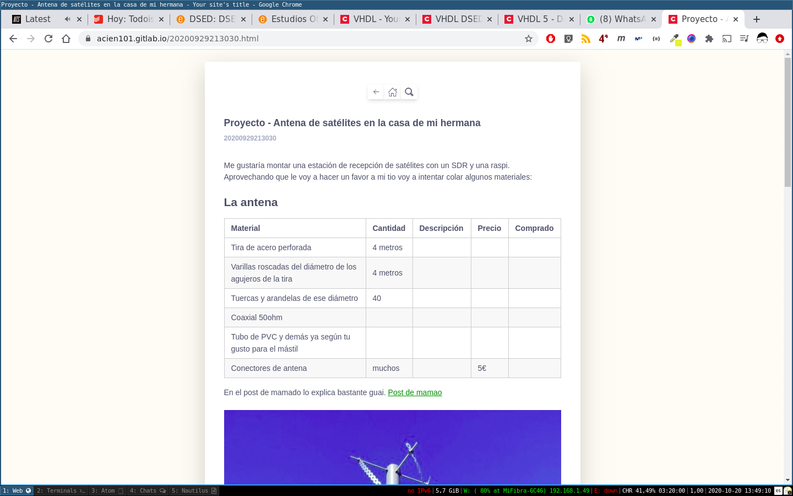

# Acien101's Zettels - My note taking tool

Original work by [Crisrojas](https://github.com/crisrojas) from [Zettels](https://github.com/crisrojas/zettels). This work differs from the original mostly on style. Checkout [gumroad](https://gumroad.com/l/zettelkasten) for supporting the original author.

Online Zettelkästen built with [Hugo](https://gohugo.io/). Useful tool for taking notes and linking knowledge. This repository is not a theme, its a blog that use [Zettels](https://github.com/crisrojas/zettels). Use it like an example or a guideline for creating your zettel.

If you want to host this theme free consider using [GitLab pages](https://docs.gitlab.com/ee/user/project/pages/). Take a look to my Zettelkästen hosted [here](https://acien101.gitlab.io/).

## Installing

### Clone repository

**Be careful to recursively clone the repository**.

```
$ git clone --recursive https://github.com/acien101/Zettels.git
```

### Installing hugo

See [hugo documentation](https://gohugo.io/getting-started/installing) to get started. Install the extender version that supports sass.

### Start the server

```
hugo server -D
```

## Linking notes

This theme includes [[wikilinks]] support.

If you want to link a note, just put it's file name inside two brackets.

That means that for the note:

```
biology.md
```

You would link it like this

```
[[biology]]
```

Output:

```html
<a href="biology.html">biology</a>
```

Make sure your filenames contain not spaces as this isn't supported by the regex yet.

**DO**

```
biologia-celular.md ✅
[[biologia-celular]] ✅
```

**DON'T**

```
biología celular.md ⛔️
[[biología celular]] ⛔️
```

**Your markdown notes go inside the `content` folder and need to comply with a valid yaml syntax if you're using metadata**

## Backlinks

Backlinks are supported right out the box. To use them properly you would want to give a title to each of your notes in the yaml header,  like so:

```
---
title: My awesome note
---

Hi! This is the content of my awesome note.
```

This way the note can be referenced in the backlinks section since the backlink function will look for the `title` key.

## MathJax

You can write math equations using **latex syntax**.

```
<div>
$$
\sqrt{\frac{\lambda}{\ro}}
$$
</div>
```

## Screenshots






