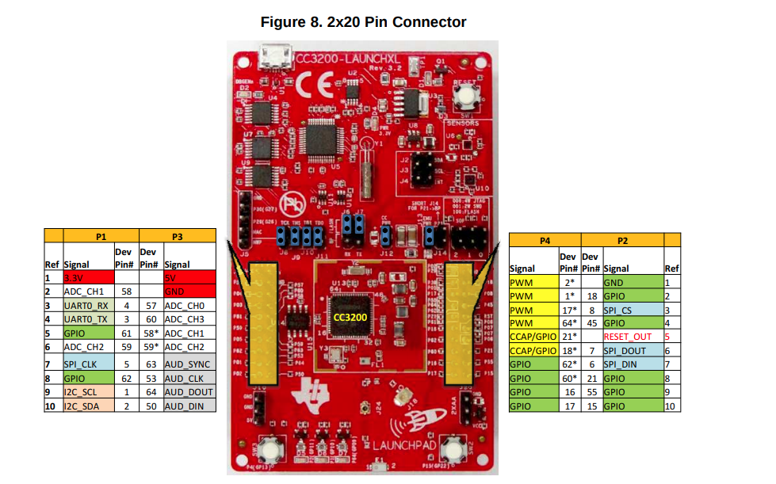
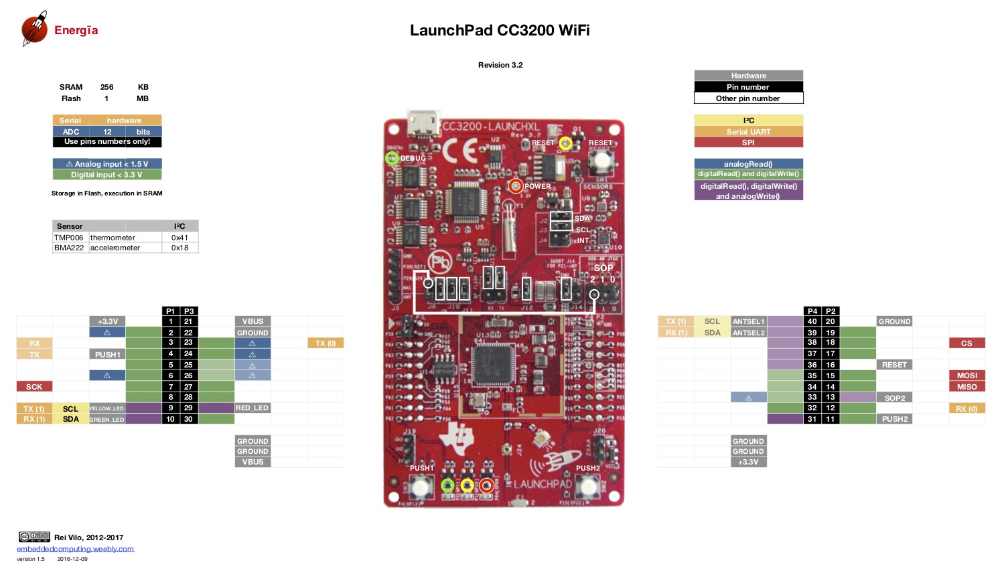

* [cc32xx_simplelink documentación de la parte de Simplelink de CC3200](http://software-dl.ti.com/ecs/cc31xx/APIs/public/cc32xx_simplelink/latest/html/index.html)
* [Configuring CC3200 UART-1 to EXT device](https://e2e.ti.com/support/wireless-connectivity/wifi/f/968/t/607403?Configuring-CC3200-UART-1-to-EXT-device)
* [Pinmux TI](https://dev.ti.com/sysconfig/?fromPinmux=true#/config/?args=--device%20CC3200%20--part%20Default%20--package%20Default%20--theme%20light) Herramienta para que te saque el pin_mux_config y ver los diferentes pines del CC3200

### Pinout

En la herramienta PinMux cuando dice Pin 60, se refiere al que está marcado en la placa como P60. Y cuando pone GP05 no se a que se refiere pero no es necesario. Con lo que hay que **fijarse en la primera imagen** para coger los numeros de los pines. Y la **segunda** es solo infomativa de los protocolos, porque el numero de pines está **MAL PUESTO**.

Y cuando en el fichero `pinmux.c` hace referencia a PIN_58 es en P58 de la placa.

