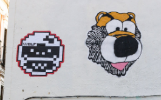
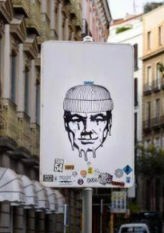
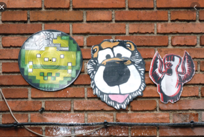

Nunca he hecho grafitti pero siempre me ha llamado la atención.

Este canal de youtube está muy guai porque suben documentales de vez en cuando de grafiteros típicos de Madrid - [writersmadridtv](https://www.youtube.com/user/writersmadridtv)

Me gustó [este video](https://www.youtube.com/watch?v=fC2h1LLcuXc) y [este video](https://www.youtube.com/watch?v=EdPHHfOBSno)

En Madrid siempre me gusta jugar al juego de buscar Leones. Consiste en encontrar esta pegatina por la ciudad… HAY MUCHÍSIMOS

De los artístar urbanos de Madrid yo destacaría a Wolf (en la izquierda de la foto), a Bloo (el león), Oberon (foto de abajo) y hadsawit (el pájaro de la última foto)

