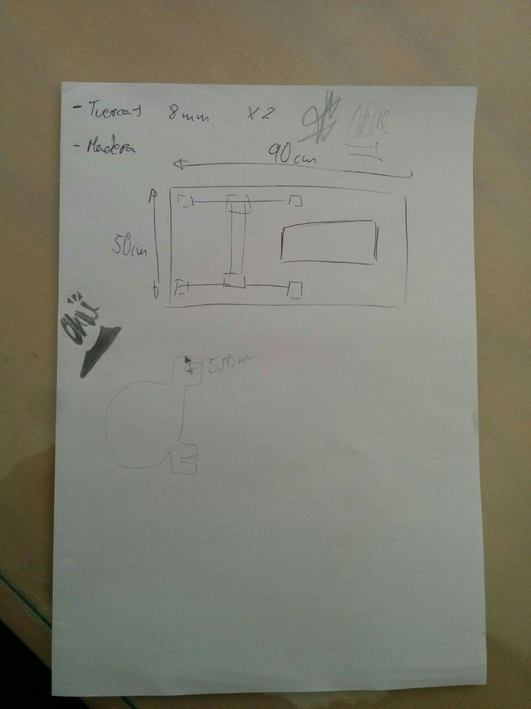

Me molaría hacer una máquina de hacer bordados a partir de mi máquina de coser. Voy a seguir este proyecto https://inkstitch.org/tutorials/embroidery-machine/

Ya tengo las piezas 3d hechas. Ahora lo que me toca es comprar los materiales que son los siguientes:

| Nombre                 | Longitud | Piezas                     | Nota                                                                         | Comprado |
|------------------------|----------|----------------------------|------------------------------------------------------------------------------|----------|
| 8mm linear slide       | 400mm    | 4 Stainless rods or better |                                                                              | Sep      |
| LM8UU                  |          | 8                          | 8mm linear bearings (Rodamientos raros)                                      | SEP      |
| 624ZZ bearings         |          | 6                          | Rodamientos                                                                  | SEP      |
| 8mm GT2 belt           | 3M       |                            | Or 3x 800mm (La correa)                                                      | Sep      |
| GT2 pulley             |          | 16                         | Teeth 3 suitable for nema17 steppers (para coger la correa con los steppers) | Sep      |
| m4 screws              | 20mm     | 60                         | some are extra                                                               | Sep      |
| M3 screws for steppers | 12mm     | 12                         | might wary on steppers used                                                  | Sep      |
| M3 screws              | 20mm     | 6                          | Belt tightening                                                              | Sep      |
| M8 screws              | 40mm     | 3                          | Belt tightening                                                              | Sep      |
| M4 nuts                |          | 60                         | Some are extra                                                               | Sep      |
| M3 nuts                |          | 6                          | Belt tightening                                                              | Sep      |
| M8 nuts                |          | 2                          | Belt tightening                                                              | Sep      |
| M5 thread rod          | 160mm    | 1                          | adjusting for Y axes                                                         | Sep      |
| M5 nuts                |          | 4                          | Adjusting for Y axes                                                         | Sep      |
| M4 wing nuts           |          | 2                          | Hoop quick connect                                                           | Sep      |

Menos las barillas todo lo demás lo debería de comprar en ebay supongo.

**Actualización** 

Ya he montado todo, ahora me falta comprar la medera y los motores. Tengo que ir al bricomart para comprar **2 tuercas de 8mm*.

La madera tiene que ser de las siguientes dimesiones:

