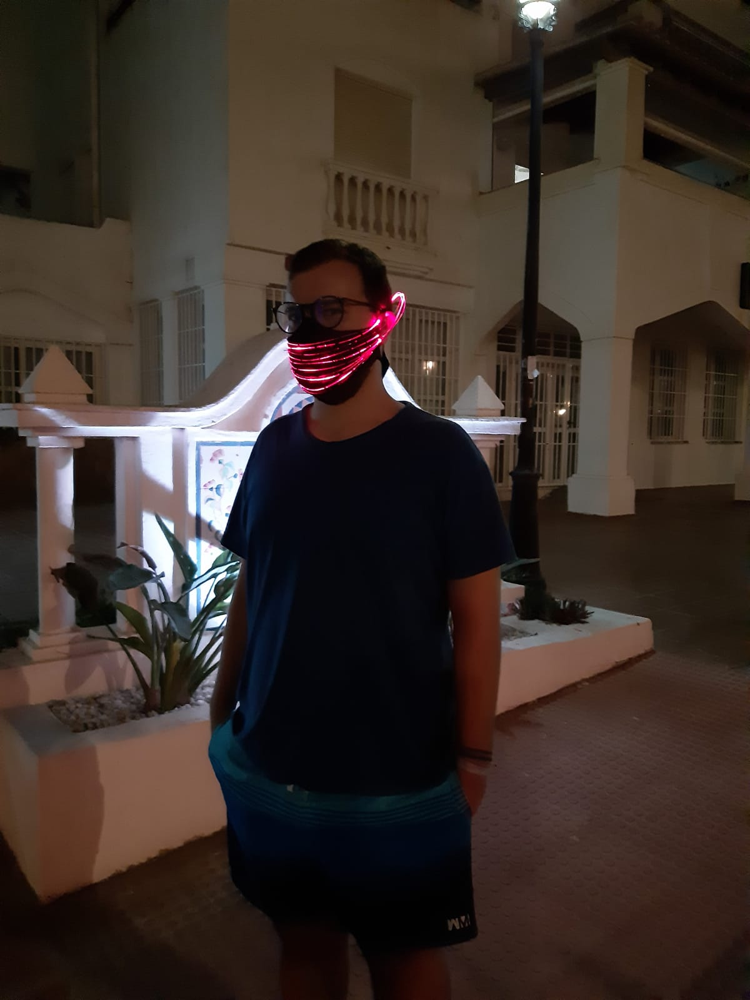
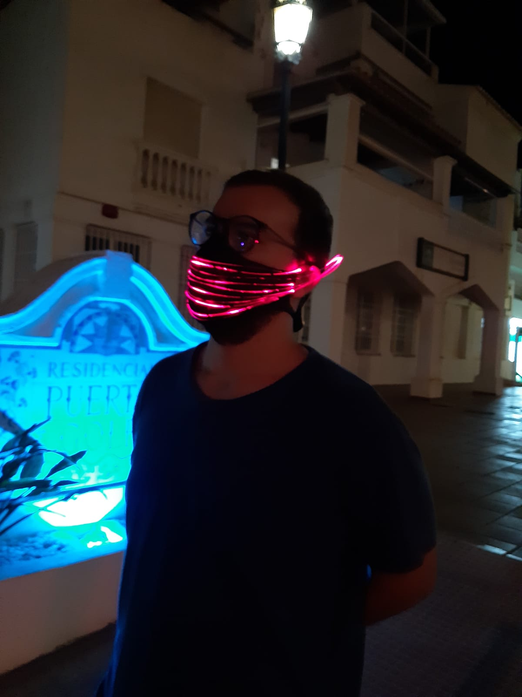
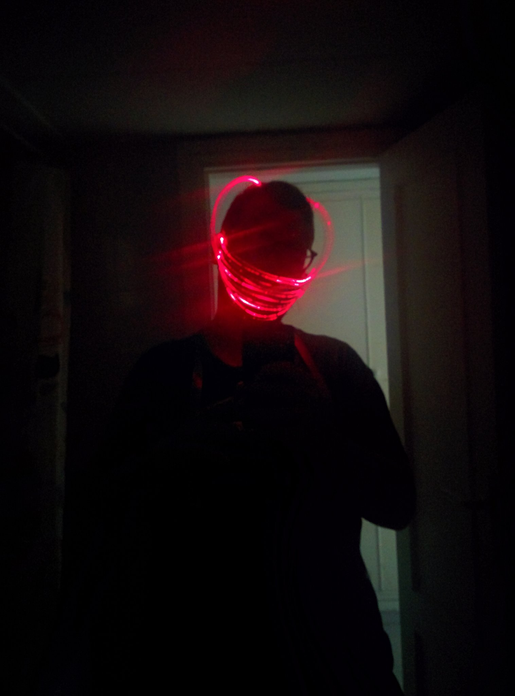

Para el casting de maestros de costura ([[20200910170105]] Maestros de la costura) he crafteado un mascarillo con fibra óptica. Estoy utilizando una batería lipo y el shield de la wemos para alimentarlo.

De este prototipo hay que cambiar la forma en la que se pone la fibra en la tela. Es muy dificil que se quede en el sitio y se tarda demasiado y hay que tener mucho cuidado cosiendo la fibra. La solución sería utilizar tul para atrapar la fibra, pero tengo que mirarlo todavía.

Estoy muy contento con el resultado. Es super llamativa y también muuuuy barata. Lo malo es que se tarda demasiado tiempo en poner la fibra, sniff.

Se podría utilizar con estas luces [[20200916104901]] Led de mucha potencia para iluminar salas y fibra óptica

El resultado ha sido este:

