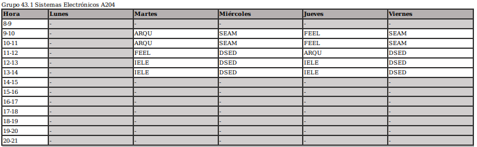
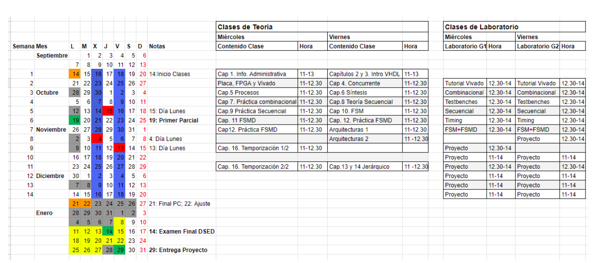

## Primer cuatrimestre

Parejas para Labos:
* DSED voy con Bocata. Es un chico trabajador. Consiste en hacer VHDL, que no me mola nada, pero bueno, por lo menos así conozco más a Bocata que es un chaval interesante.
* ARQU voy con $anti. Seguro que me lo paso bien con el.

### Calendario de parciales

* **Lunes 19 de octubre P1 DSED** - Capítulos 1-9 del libro
* **Lunes 26 de octubre P1 IELE** - Temas 1, 2, 3 y parte del 4
* **Miércoles 4 de noviembre P1 de ARQU** - Temas 1, 2 y 3
* **Viernes 13 de noviembre P1 SEAM** - Temas 1, 2 y 3

#### [DSED] DISEÑO DE SISTEMAS ELECTRÓNICOS DIGITALES

**Palabras de Iri** En DSED es un proyecto tochisimo de VHDL

El calendario es el siguiente:

Voy con bocata y tenemos **turno de viernes de 12:30 a 14**, es decir, los siguientes días:
* 25 de septiembre - **Tutorial Vivado**
* 2 de Octubre - **Combinacional**
* 9 de octubre - **Testbenches**
* 16 de octubre - **Secuencial**
* 23 de octubre - **Timing**
* 30 de octubre - **FSM+FSMD**
* Proyectos los **6, 20, 27 de noviembre y 4, 11 y 18 de diciembre**.

**Los laboratorios son obligatorios**

Tengo que recoger la placa `Recogida: Lunes 21 de septiembre de 11h a 13h en el laboratorio B.043`

La evaluación funciona:
* 10 % laboratorio
* 50% proyecto FPGA
* 20% P1 día **19 de octubre** -  Capítulos 1-9 del libro
* 20% P2 día **14 de enero(?)** - Capítulos 10-14 y 16 del libro más apuntes de clase sobre síntesis de alto nivel

#### [ARQU] ARQUITECTURA DE PROCESADORES

**Palabras de Iri** En ARQU son como 5 laboratorios y tal que hay que prepararse un poco antes porque sino no tienes ni idea y llevar la asignatura al dia porque sino ni zorra la verdad, a mi esta se me dió fatal porque no la llevaba al día

#### [FEEL] FABRICACIÓN DE EQUIPOS ELECTRÓNICOS

**Palabras de Iri** En FEEL es lo de diseño de PCB, son como 4/5 entregables realizando poco a poco el proceso de diseño de la PCB que os mande con las restricciones que os manden y tal

**Bibliografía recomendada** -> Pecht, M. _Handbook of Electronic Package Design._ Marcel Dekker, New York, 1991.

Calendario:
* 1ª entrega 19 oct
* 2ª entrega 2 nov
* 3ª entrega 23 nov
* 4ª entrega 7 dic

##### Proyecto FEEL

* [[20201002202925]] FEEL - 1er Entregable
* [[20201005175530]] FEEL - SoC con LoraWAN

#### [SEAM] SISTEMAS ELECTRÓNICOS ANALÓGICOS Y MIXTOS

Hay que hacer como una simulación de PSPICE con dos entregables. Dice iri que hay que hacerla solo y que son un coñazo.

Evaluación:
* 15% Práctica 1 - Entrega **11 de Noviembre de 2020**
* 40% P1 - Temas 1, 2 y 3 el **Viernes 13 de Noviembre de 2020**
* 15% Práctica 2 - Entrega **24 de enero de 2021**
* 30% P2 - Temas 4 y 5 el **Martes 26 de enero 2021**

#### [IELE] INSTRUMENTACIÓN ELECTRÓNICA

En IELE es un laboratorio usando LabView y tal y aparatos en el laboratorio que son como 4 sesiones y luego hacer la memoria y tal.

 IELE(equipo de 3/4)
 
 Evaluación:
 * 40% P1 - 2 o 4 de noviembre por esas fechas. Octava semana de clase
 * 35% P2 - 
 * 25% Entrega memoria de las prácticas de laboratorio