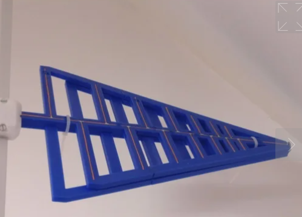

He encontrado esto que tiene muuuuuy buena pinta:

* [Soportes de antena](https://www.thingiverse.com/thing:4303946)
* [Antena](https://www.thingiverse.com/thing:4303929)

Viene heredada de [esta antena](https://www.thingiverse.com/thing:3221812) que en las fotos explica como se hace. En [este](https://www.thingiverse.com/thing:3221812) pone que alomejor necesitas un balun.

