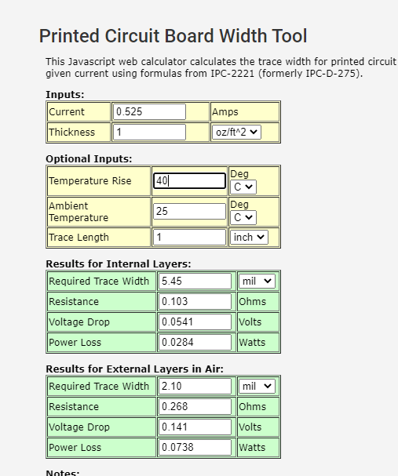

El fabricante de la PCB será **JLCPCB**. Las características de diseño de la PCB la haremos conforme a la “*hoja de capacidades del fabricante*” que se pueden encontrar [aquí](https://jlcpcb.com/capabilities/Capabilities).

Para tomar las decisiones de diseño tendremos que ver las características de los componentes. [[20201002203154]] FEEL - Lista de componentes

### Número de capas

Tendremos en torno a 10 integrados en la placa. Los más delicados para enrutar serán el microcontrolador, [nRF9160](https://www.nordicsemi.com/-/media/DocLib/Other/Product_Spec/nRF9160OPSv071pdf.pdf), y el cargador de la batería lipo, [ADP5360](https://www.analog.com/media/en/technical-documentation/data-sheets/ADP5360.pdf).

En el primer caso, el microcontrolador, tenemos un encapsulado SMD LGA 16.00 x 10.50 mm, con 127 pines. En el segundo caso, el cargador de la batería, tenemos un encapsulado SMD 2.56 mm × 2.56 mm wafer level chip scale package (WLCSP) con 32 pines.

No todos esos pines se usarán, pero nos dan una pista de que tendremos muchas pistas.

También hay que tener en cuenta para este aspecto que **el fabricante nos puede proporcionar 1, 2, 4 y 6 capas**.

Por este motivo el número de capas debería de ser entre 2 y 4. A la hora de diseñar la placa se intentará hacer uso de 2, pero si se vuelve demasiado tedioso se extenderá a 4 (muy probablemente).

### Capas con componentes

En nuestro diseño tendremos entre 8 y 10 integrados. Con lo que por buenas prácticas los posicionaremos sólo en la capa superior. Esto nos ahorrará dinero y tiempo a la hora de soldar los componentes.

En cuanto a los componente through-hole como conectores y demás pines, si que serán por las dos capas, como no podía ser de otra forma.

### Sustrato

El fabricante nos puede proporcionar **FR-4 Tg 130-140/ Tg 155**, esto es, laminado epoxi de fibra de vidrio.

### Tipo de componentes

Todos los componentes usados serán **encapsulados SMD**, exceptuando los conectores que serán through-hole.

### Ancho del cobre

Usamos [Trace Width Calculator](https://www.4pcb.com/trace-width-calculator.html).

* **Current**. La máxima corriente será del microcontrolador, problamente cuando transmita, esto será buscar en el [datasheet del nRF9160](https://www.nordicsemi.com/-/media/DocLib/Other/Product_Spec/nRF9160OPSv071pdf.pdf) en el punto 5.2.1.14, Modem peak current consumption que en el peor de los escenarios, emitiendo con Pout>20 dBm con Vbat 3.0V a 85ºC serán 525mA.
* **Thickness**. Esto nos lo da el fabricante que será **1 oz**.
* **Temperature Rise**. Suponiendo qeu la temperatura ambiente será de 25ºC, en las características de diseño dijimos que la temperatura podía ascender hasta los 65º C. Estos es que la temperatura podía subir haste 40ºC
* **Ambient Temperature** serán 25ºC.
* **Trace Length** 1 inch

Esto nos da como salida:

Con lo que el Trace Width tendrá que ser de 2.1 mil para las pistas de top y bottom de la alimentación de las pistas del microcontrolador. En el caso de usar rutas en las capas intermedias tendría que ser de 5.45 mil, pero no será el caso para las rutas de alimentación.

### Grosor del PCB

El grosor de la PCB será de 0.8 mm, que es el mínimo grosor que el fabricante nos puede proporcionar con 4 capas.