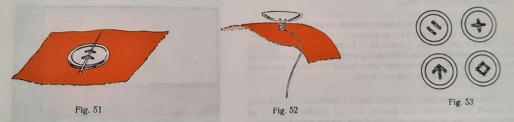

### Ojales

Del tema de los ojales destacar que se hacen siempre con tela doble, esto es, habrá que añadir una **vista** con un hilván.

Tipos de ojales:
* Ojales de hilo
* Ojal de sastre
* Ojal ribetado de tela (con un bies)

### Botones

Los botones convendrá hacerlos con cierta holgura para poder hacerles un cuella debajo del botón, que será enrollar varias veces la hebra para mayor seguridad.

Las **presillas** se emplean para abrochar corchetes o botones sin necesidad de ojales.

### Aberturas de faldas

Las faldas tendrán que tenes una abertura en el **costado izquierdo** junto a la cintura.
* Cuando no es muy ceñida. Dejar **12 cm** sin coser y poner cierres automáticos a los márgenes de costura.
* **Abertura con pata** Se añaden dos tiras cortadas al hilo. En el libro pone qu ese ponen por la parte de la cintura, pero es muy común que vayan en el bajo.
* **Abertura con cremallera**
* **Cinturilla** En las faldas después de ser rematada con la abertura en el costado hay que poner una cinturilla para que esté bien ceñoda. La cinturalla hacer de tela fuerte, y en los extremos llevarán corchetes. Dejaremos 2 cm más en la tela para poder coser los corchetes. Los corchetes tienen que coincidi con la apertura