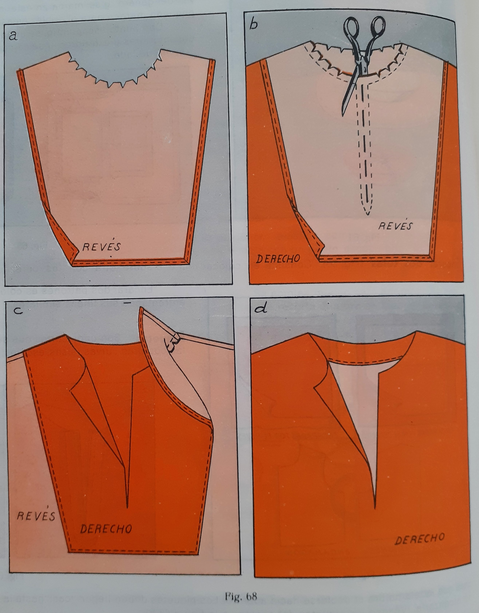
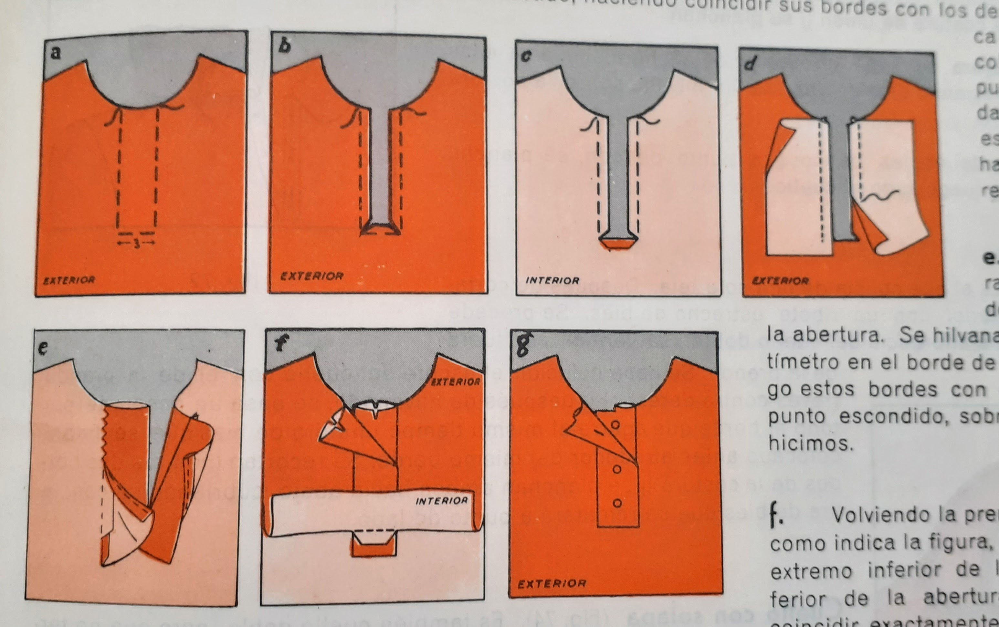

Los **piquetes** son unos cortes (triangulares) que se dan en los margenes de las costuras curvas para que la tela no se doble. Llega el corte casi hasta la line de señales.

### Aberturas

#### Aberturas delanteras

Para cuellos y escotes. Existen distintos tipos:
* **Abertura con bies** Basta con poner una tira de bies en el borde para rematar.
* **Abertura con vistas**
    
    1. Se recorta un vista y se hacen unos piquetes en el cuello
    2. Se encara con la prenda. Se hilvana y se pespunta hombro hombro.
    3. Se mete al tela hacia adentro y se unen por la señan con un punto escondido.
* **Abertura con pata**. Cuando la abertura del escote es bastante ancha y larga
    
    1. Se señala anchura 3 cm con hilván.
    2. Se recorta a abertura
    3. Se encará la parte inferior al reves de la tela
    4. se cortan trozos que tenga unos 2 mas largo que la abertura, y doble de anchura que la abertura mas un margen de costura de centimetro y medio. Los acemos coincidir
    5. Se vuelve y se cose con un doble de medio cm con punto escondido.
    6. Ponemos la prenda al derecho y cosemos la parte inferior.
    7. cortamos dos piquetes y terminamos la parte superior de la tela.
 
### Cuellos

En un cuello la tela de arriba se llama **encimera** y la tela de abajo **bajera**.

Para hacer el cuello con dos piezas hay que tener en cuenta que no tienen que ser exactamente iguales. Es mejor que la encimera tenga un par de milimetros más de anchura por todo su contorno que la bajera. Esta holgura vendrá bien cuando se cosan las piezas

Diferentes formas:
* Cuello *con dos piezas*
* Cuello simple. Utilizando una única tela de cuello y rematando con un bies
* Cuello con solapa

Mirar el libro porque es una movida.
 
    
