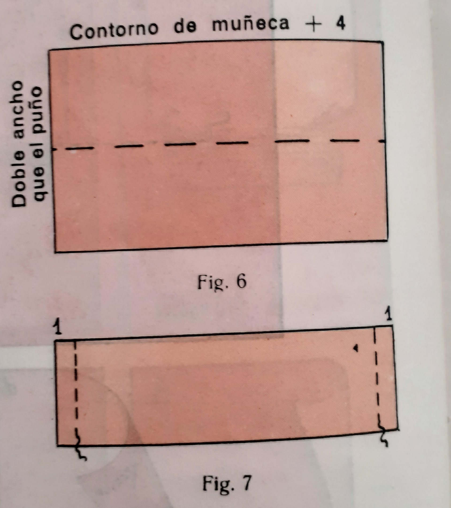

### Bolsillos

Distintos tipos de bolsillos:
* Bolsillos de plastrón
* Bolsillos cortados
* Bolsillos de ribete
* Bolsillos de tira
* Bolsillos de cartera

### Puños

Si el bajo de puño es de poco vuelo basta con dejar sin coser un trecho inferior de la sangria y hacer el dobladillo abajo y colocar presillas.

Diferentes tipos de puños:
* Puño corriente: El usado en las fotos
* Puño camisero de señora: Como el anterior pero es un par de centrimetros más largo para poder abrocharlo con gemelos
* Puño sport: Como el anterior pero se abrocha con botón