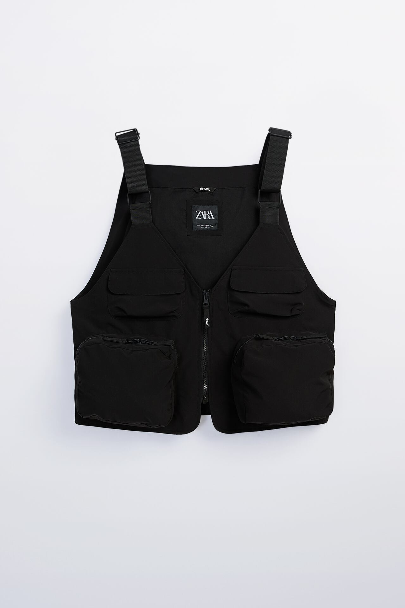
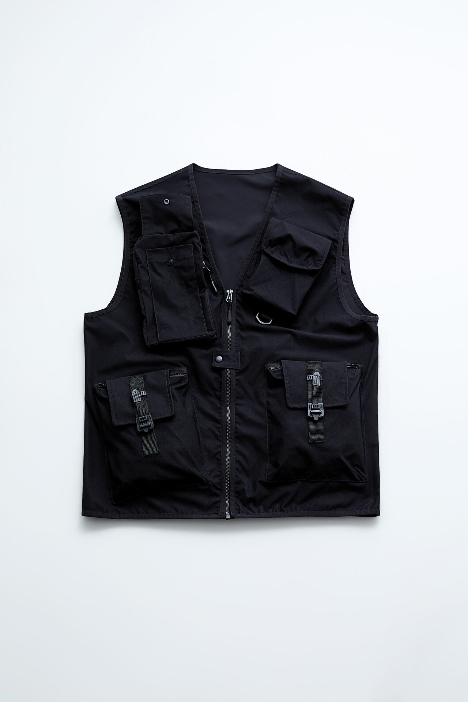
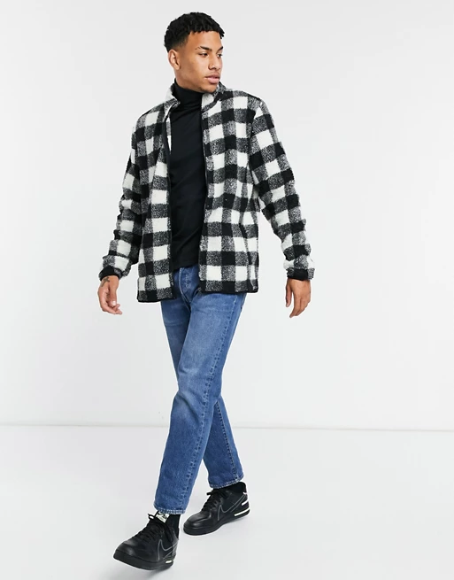
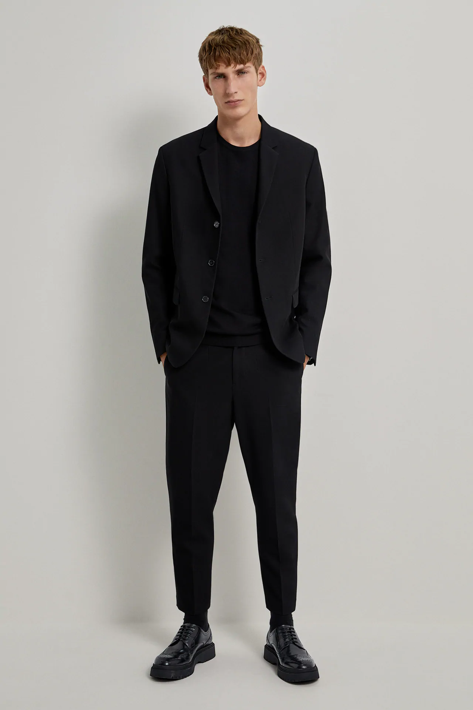

Después de estar en el casting de \*\*\*\*\*, me he dado cuenta de que me puedo hacer un montón de ropa para mi y aprendería un huevo. Así que aquí pondré referencias a cosas que me quiero hacer. Intetaré en lo máximo de lo posible hacer mis propios patrones para aprender de patronaje.

### Chaleco técnico

Se trata de un artículo de zara. Está la ref [aquí](https://www.zara.com/es/es/chaleco-t%C3%A9cnico-utility-p01926300.html?v1=61026857&v2=1546823)

La ref de zara [aquí](https://www.zara.com/es/es/chaleco-t%C3%A9cnico-utility-p05320408.html?v1=51049699&v2=1546823)

### Chaqueta con cuello | Brazer

En realidad me gustaría que tuviese botones y que fuese más sería pero con una tela distinta. Algo tipo al chaval que conocí en el casting. El link [aquí](https://www.asos.com/es/soul-star/chaqueta-de-borreguito-con-cuello-alzado-de-cuadros-en-negro-y-blanco-de-soul-star/prd/20193363?clr=blanco-negro&colourwayid=60016450&SearchQuery=&cid=2112).

[Otra que me gusta](https://www.zara.com/es/es/blazer-estructura-p05891636.html?v1=66343390&v2=1546766)