## Pasos

1. Cortamos la tela con las siguientes medidas

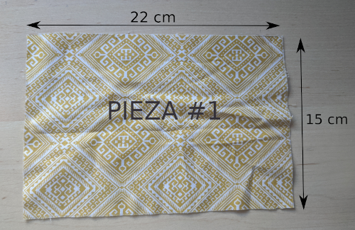

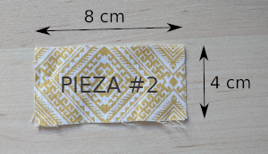

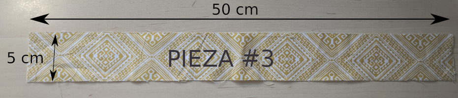

2. Hacemos el prezpunte de la pieza #1 y #2 **del reves**. Para ahorranos tiempo lo podemos hacer directamente poniendo alfileres perpendiculares a la costura.

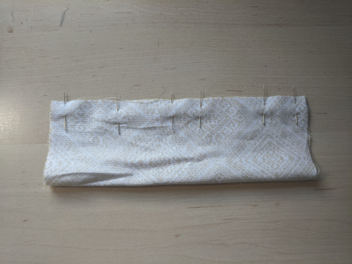

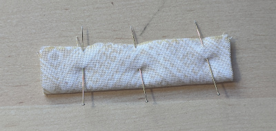

3. Cosemos las piezas #1 y #2, siguiendo el prezpunte del paso anterior.

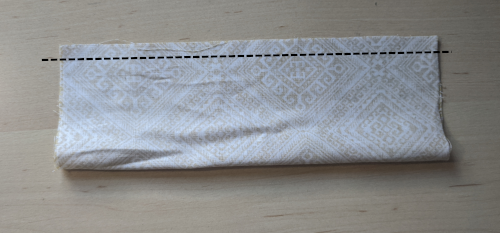

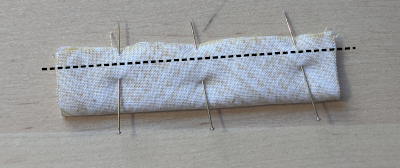

4. Le damos la vuelta a las dos piezas. Y las planchamos con la costura en el medio.

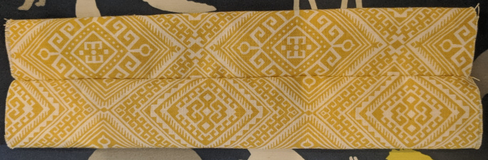

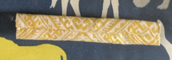

5. Doblamos la pieza #1 dejando la costura hacia fuera y la cosemos.

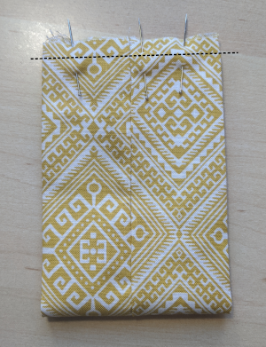

6. Le damos la vuelta a la pieza #1 y la planchamos para darle forma.

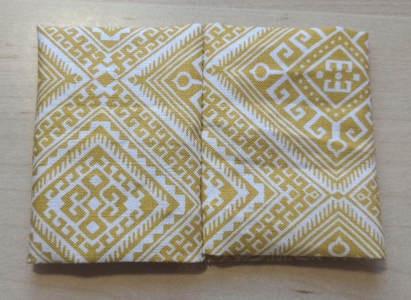

Tendremos que pancharla haciendo pliegues en las lineas:

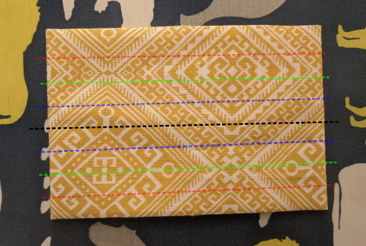

Vamos poco a poco dándole forma a la pajarita con la plancha:

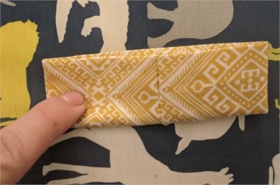

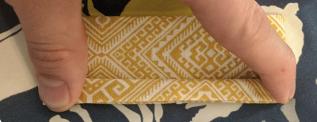

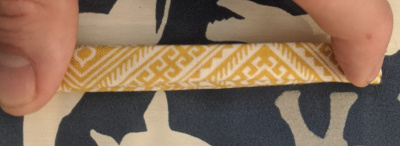

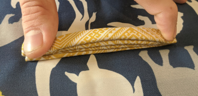

Tendremos que dejarla así:

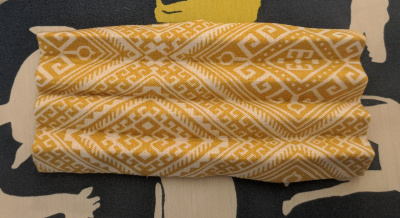

7. Le damos un puntillo a la pajarita justo en el medio:

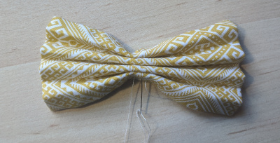

8. Ahora tendremos que hacer la pieza que tape la costura anterior. Para ello cojemos la pieza #2 y la doblamos con la costura hacía fuera y la cosemos con la siguiente medida:

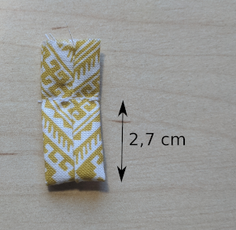

9. Cortamos el sobrante de la pieza #2 y le damos la vuelta. Y metemos la pajarita (pieza #1) por la pieza #2, con la costura detrás, para que se quede así:

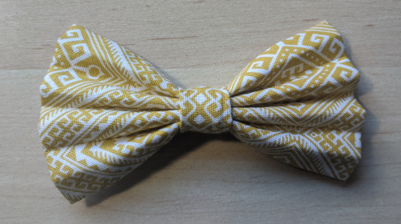

10. Ahora tendremos que hacer la cinta que sujeta la pajarita al cuello. Para ello cogemos la pieza #3 y la doblamos del reves y la cogemos con alfileres:

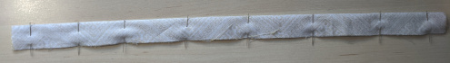

Y la planchamos:

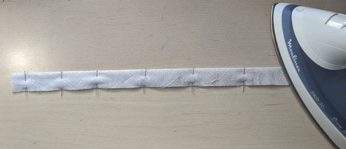

11. Ahora tendremos que marcar las nuevas medidas que es donde haremos la próxima costura:

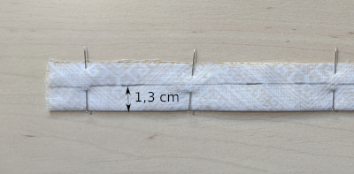

12. Cosemos toda la pieza justo por la costura. Con esta hay que tener cuidado que es muy importante:

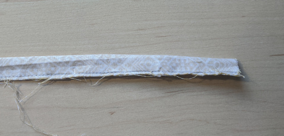

13. Le damos la vuelta a la pieza #3. Yo suelo pillar un extremo con un destornillador y tiro dándole la vuelta a la pieza:

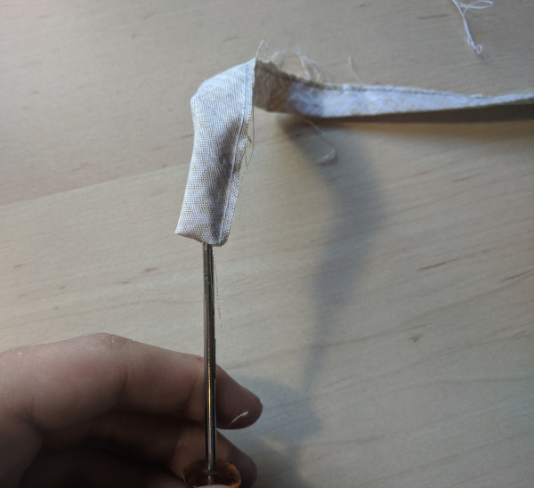

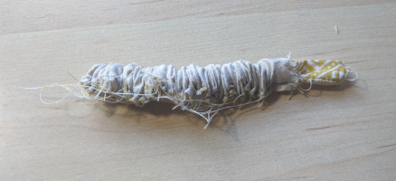

14. Ahora planchamos la pieza #3 **con la costura en un extremo**:

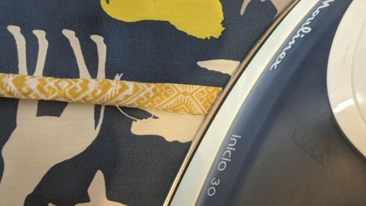

15. Ahora solo nos queda coser las piezas para ajustar el tamaño del lazo:

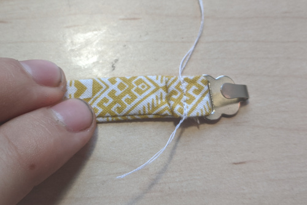

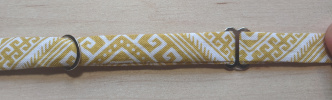

16. Terminamos la pajarita poniendo el lazo:

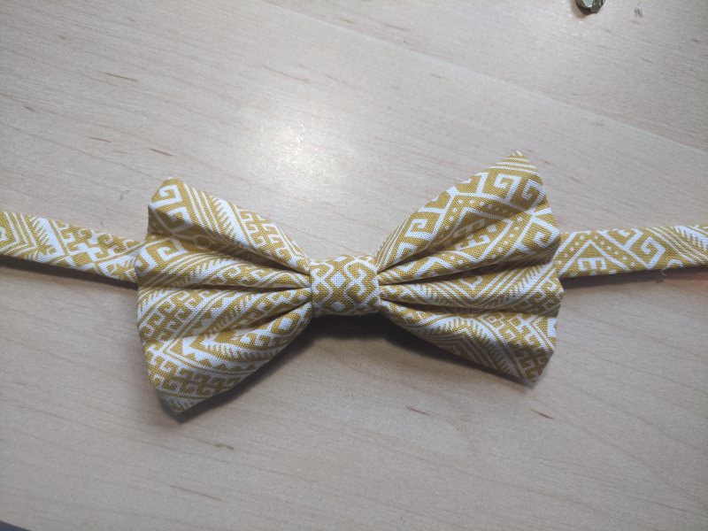