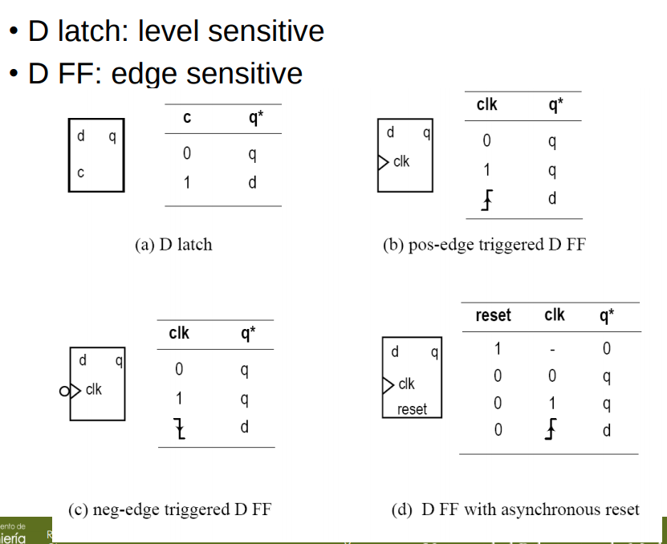
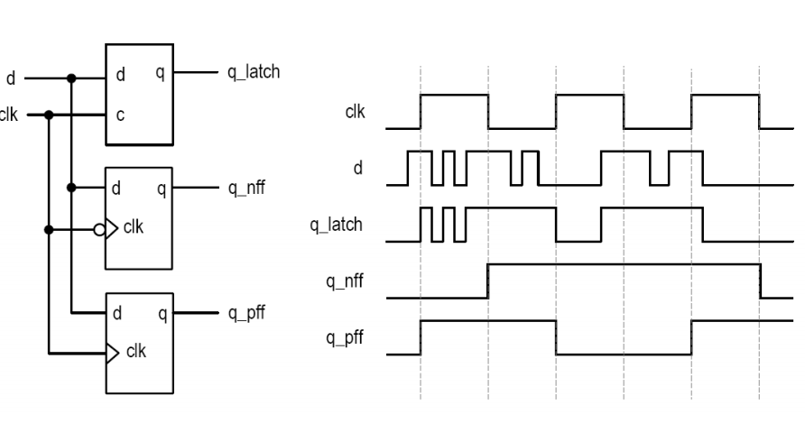
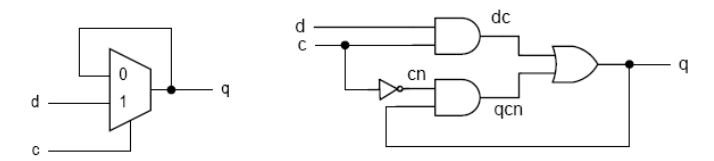
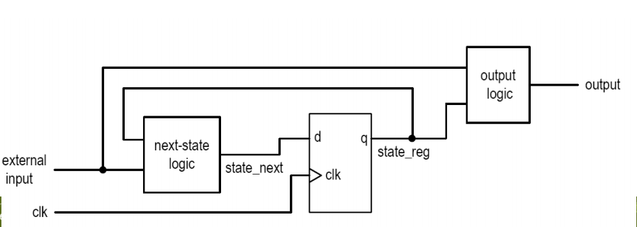

Circuitos secuenciales -> La salida depende de las entradas y del estado (memoria).






### D Latch




```VHDL
library ieee;
use ieee.std_logic_1164.all;
entity dlatch is
    port(
        c: in std_logic;
        d: in std_logic;
        q: out std_logic
    );
end dlatch;
architecture arch of dlatch is
begin
    process (c, d)
    begin
        if (c='1') then
            q <= d;
        end if;
    end process;
end arch;
```

### Pos edge-triggered D FF

```VHDL
library ieee;
use ieee.std_logic_1164.all;
entity dff is
    port(
        clk: in std_logic;
        d: in std_logic;
        q: out std_logic
    );
end dff;
architecture arch of dff is
begin
    process (clk)
    begin
        if (clk'event and clk='1') then
            q <= d;
        end if;
    end process;
end arch;
```

### D FF with async reset

```VHDL
library ieee;
use ieee.std_logic_1164.all;
entity dffr is
    port(
        clk: in std_logic;
        reset: in std_logic;
        d: in std_logic;
        q: out std_logic
    );
end dffr;
architecture arch of dffr is
begin
    process (clk, reset)
    begin
        if (reset='1') then
            q <='0';
        elsif (clk'event and clk='1') then
            q <= d;
        end if;
    end process;
end arch;
```

### Basic Block Diagram




**state_reg** -> Memory element
**next-state logic** -> Circuito conbinacional
**output logic** -> Circuito combinacional

Cuando se produce un flanco de reloj, state_next se guarda en registro -> state_reg

El valor de next_state determina el nuevo valor para la lógica de salida.

Vuelve a subir l flanco de reloj y el nuevo valor de state_next se guarda en registro

#### Ejemplo de un contador

Ejemplo de un contador con enable, que hace "000", "001", "011", "101", "111", "010"

```VHDL
library IEEE;
use IEEE.STD_LOGIC_1164.ALL;
use ieee.numeric_std.all;

entity my_count is
    Port ( rst : in STD_LOGIC;
           clk : in STD_LOGIC;
           en : in STD_LOGIC;
           count : out UNSIGNED (2 downto 0));
end my_count;

architecture Behavioral of my_count is

signal current_state, next_state: UNSIGNED (2 downto 0);

begin

--next state logic
process(current_state)
begin
    case current_state is
        when "000" =>
            next_state <= "001";
        when "001" =>
            next_state <= "011";
        when "011" =>
            next_state <= "101";
        when "101" =>
            next_state <= "111";
        when "111" =>
            next_state <= "010";
        when others =>
            next_state <= "000";
    end case;
end process;

--state register
process(clk, rst)
begin
  if(rst = '1') then
    current_state <= (others => '0');
  elsif(clk'event and clk= '1') then
    if(en = '1') then
      current_state <= next_state;
    end if;
  end if;
end process;

--output logic
count <= current_state;

end Behavioral;

```

#### Ejemplo rotar a la derecha con un parallel load

```VHDL
library IEEE;
use IEEE.STD_LOGIC_1164.ALL;
use ieee.numeric_std.all;

entity my_shift is
    Port ( rst : in STD_LOGIC;
           clk : in STD_LOGIC;
           parallel_load : in STD_LOGIC;
           rotate : in STD_LOGIC_VECTOR(2 downto 0);
           parallel_in : in STD_LOGIC_VECTOR(7 downto 0);
           data_out : out STD_LOGIC_VECTOR(7 downto 0));
end my_shift;

architecture Behavioral of my_shift is

signal current_state, next_state: STD_LOGIC_VECTOR (7 downto 0);

begin

--next state logic
process(current_state, parallel_load, rotate, parallel_in)
begin
    if(parallel_load = '1') then
        next_state <= parallel_in;
    else
        next_state <= std_logic_vector(shift_right(unsigned(current_state), to_integer(unsigned(rotate))));
    end if;
end process;

--state register
process(clk, rst)
begin
  if(rst = '1') then
    current_state <= (others => '0');
  elsif(clk'event and clk= '1') then
    current_state <= next_state;
  end if;
end process;

--output logic
data_out <= current_state;

end Behavioral;

```

### Síntesis del código

Después de ver el código secuencial podemos hacernos una idea de cómo se sintetizará en el circuito. Se pocederá viendo la siguiente imagen:


