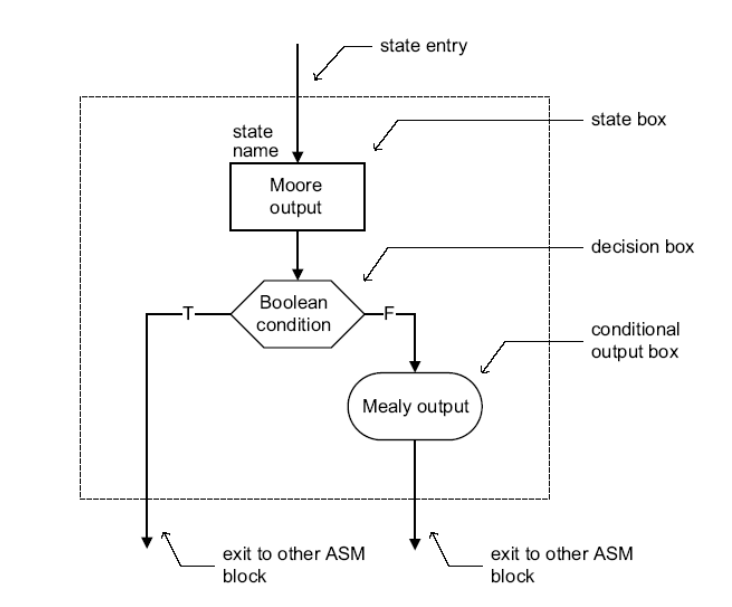

Algunas cosillas que hay que tener en cuenta para hacer el examen:

### Ahorrar operaciones y espacio en hardware

Para disminuir el tamaño de un circuito lógico hay que ver su salida y coger las partes comunes.

La resta de **a - b** se puede hacer como **a + b' +1** siendo, b' la negación.

### Riesgos y como solventarlos

1. Uso de relojes derivados. Se debería de utilizar flipflops y en general todos los bloques con un único relojo para que el sistema sea síncrono, de otra manera aparecerán errores, como skew o jitter.
2. Incluir el reset en la lista de sensibilidad
3. Poner señales con inout cuando solo son de salida.
4. Utilizar integer. Se pierde control de cuatos bits se van a utilizar. **Mejor usar std_logic_vector()**
5. El uso de reset asíncrono produde errores. Se debería de utilizar reset y señales de control síncronas.
6. El mala practica mezclar elementos combinacionales y secuenciales en un único proceso. Porque es dificil de sintetizar. Hay que pensar en hardware.
7. Todas las variables de entrada tienen que estar en la lista de sensibilidad del process


### Asignación dentro de un process

Hay que tener claras algunas cosas. Leer [[20201015183911]] VHDL 4 - Elementos sequenciales | Processes | Conditionals in processes | for loop. 

```VHDL
process(y)
begin
    x <= y;
    z <= not x;
end process;
```

El código de arriba no tendría sentido, porque la asignación con <\= cambian al final del process. 

```VHDL
process(y)
begin
    x := y;
    z <= not x;
end process;
```

El código anterior es cómo se debería de hacer.

```VHDL
process(y)
begin
    a <= x;
    x := y;
end process;
```
Este código hará que a sea x en el primer ciclo. La asignación se produce al final del process pero con el valor que tenía cuando lo asignaste.

### Máquinas de estados finitos




Moore -> La salida depende del estado
Meely -> La salida depende del stado y entradas. Usar menos estados, es más rápido y no suelen tener glitches.

#### Evitar glitches

Para Mealy -> Poner una etapa de flipflops que retrase un ciclo la salida

Para Moore -> Quitar lógica de salida y mejorar la asignación de estados.
